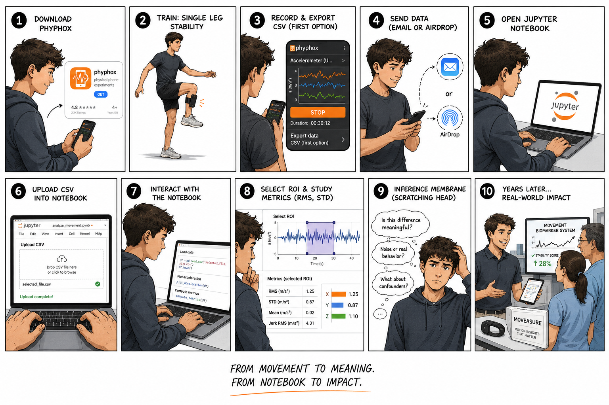

# Wearable Tech Devices — RMIT MIET2572


---




## Course Focus

This repository contains workshop material, notebooks, and supporting resources for the course:

**MIET2572 — Wearable Tech Devices**

The course explores how wearable systems move from:

```text
movement → data → interpretation
```

Core ideas explored throughout the workshops include:

- wearable sensing
- preprocessing
- movement metrics
- signal interpretation
- model assumptions
- wearable claims
- human-centred measurement

> Measurement is technical. Wearability is human.

> What can a wearable truly measure?

---

## Repository Structure

```text
.
├── docs
│   └── banner.png
├── README.md
├── Workshop1_Motion_as_Signal
│   ├── Lab-workshop1v0-1.pdf
│   └── Motion_as_Signal.ipynb
├── Workshop2_HeartRate
│   └── Lab-workshop2-PolarHeartRate.pdf
├── Workshop3_From_Idea_to_Measurement
│   ├── Lab-workshop3_From_Idea_to_Measurement.pdf
│   ├── Week4_Motion_to_Meaning_Building_Wearable_Indices.ipynb
│   └── Week7_Lab-workshop3_From_Idea_to_Measurement.ipynb
└── Workshop4_From_Signal_to_Metrics
    ├── Lab-workshop4_From_Signal_to_Metrics.pdf
    ├── Week9_From_Signal_to_Metrics.ipynb
    └── Week9_Inclination_Data_From_Signal_to_Metrics.ipynb
```

---

## Workshops Overview

### Workshop 1 — Motion as Signal

Introduction to smartphone sensing, acceleration signals, and movement detection.

Topics:
- acceleration magnitude
- smoothing
- thresholding
- peak detection
- event detection

---

### Workshop 2 — Heart Rate

Heart rate sensing and wearable measurement limitations.

Topics:
- heart rate measurement
- physiological interpretation
- wearable limitations
- temporal behaviour

---

### Workshop 3 — From Idea to Measurement

Moving from movement detection toward wearable interpretation and project definition.

Topics:
- project framing
- movement meaning
- wearable indices
- assumptions
- claim formulation

---

### Workshop 4 — From Signal to Metrics

Exploration of movement metrics and preprocessing strategies.

Topics:
- RMS
- STD
- jerk
- cadence
- ROI selection
- preprocessing
- metric interpretation

---

## How to Use the Notebooks

The notebooks are designed to work with smartphone sensor recordings (Phyphox recommended).

Typical workflow:

```text
sensor recording
→ preprocessing
→ metric extraction
→ interpretation
```

Students are encouraged to:
- upload their own CSV recordings
- explore preprocessing choices
- compare metrics across conditions
- reflect on limitations and assumptions

---

## Key Course Message

A wearable does not only measure movement.

It makes claims about the body.

Inference is never automatic.

It is a claim to be built with engineering.

---

## Final Project Philosophy

The final presentations are intended to be:

- concise
- experimental
- exploratory
- engineering-focused

A simple and well-explained result is stronger than a complicated unclear system.

---
## Course Coordinator

Dr Francisco Tovar
Biomedical Engineering • CFD • Microfluidics • Translational Systems Engineering • Instrumentation RMIT University — Melbourne, Australia

Adjunct Senior Research Fellow. Department of Diabetes, School of Translational Medicine, Faculty of Medicine Nursing and Health Sciences. Monash University.
